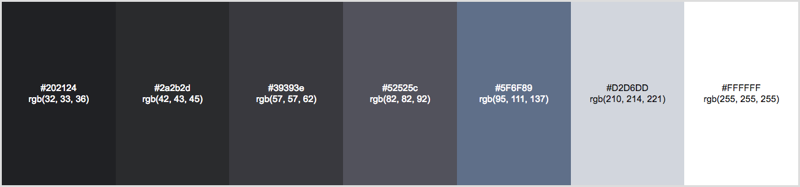

# Dark Gray Theme (WebExtension)

Another dark gray theme for Firefox

## Color Palette



## Screenshots


## Extra

Right now there is now way to change the hover background color of a tab. Though, if you still want to change this value you can add the following lines in `userChrome.css` which should be located in your [profile](https://support.mozilla.org/en-US/kb/profiles-where-firefox-stores-user-data#w_how-do-i-find-my-profile) directory under `chrome` directory (`<YOUR_PROFILE_DIRECTORY>/chrome/userChrome.css`).

```css
:root:-moz-lwtheme-brighttext .tabbrowser-tab:hover > .tab-stack > .tab-background:not([selected=true]) {
  background-color: var(--toolbar-bgcolor) !important;
}
```

## License

[Creative Commons Attribution 3.0](https://creativecommons.org/licenses/by/3.0/)
